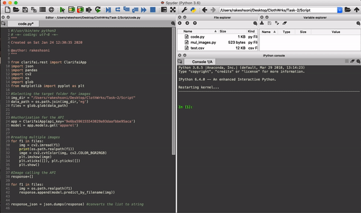

# Warehouse-to-Website-software-an-automated-cataloging-system
An automated cataloguing system for fashion products. This software can be used by fashion E-Commerce based websites, enabling them to straightaway put the product on the website from warehouse by running this in backend.

<h3><b>Approach: </b></h3> 

1. Load images
2. Send request to Clarifai API (https://docs.clarifai.com/api-guide/api-overview)
3. Each individual image calls this API 
4. Store responses of every image in a json and get json array
5. Convert json into csv and upload final csv on your application.

<h3><b>Software in action: </b></h3> 

